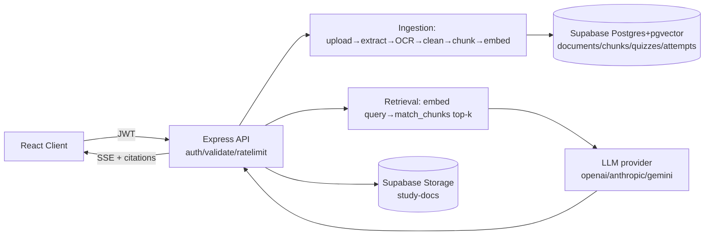

# Architecture

```mermaid
flowchart LR
  U[React Client] -->|JWT| API[Express API<br/>auth/validate/ratelimit]
  API --> ING[Ingestion: upload→extract→OCR→clean→chunk→embed]
  ING --> DB[(Supabase Postgres+pgvector<br/>documents/chunks/quizzes/attempts)]
  API --> RET[Retrieval: embed query→match_chunks top-k]
  RET --> LLM[LLM provider<br/>openai/anthropic/gemini]
  LLM --> API
  API -->|SSE + citations| U
  API --> STO[(Supabase Storage<br/>study-docs)]
```

Layered backend: `routes → controllers (inline) → services → repositories (supabaseAdmin)`.
LLM interface: `generateText / generateJSON / embed / stream` — swap provider via env.
